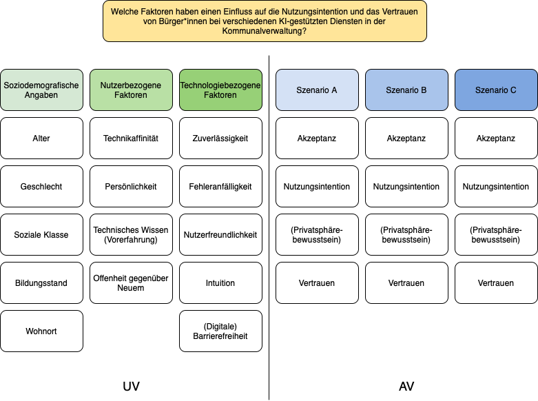

# Teammitglieder
* NS
* AB
* KA
* YK

# Forschungsfrage
* Welche Faktoren haben einen Einfluss auf die Nutzungsintention und das Vertrauen von Bürger*innen bei verschiedenen KI-gestützten Diensten in der Kommunalverwaltung?

# Faktorenraum

# Operationalisierung

* Vertrauen: Trust in Automation Scale (TiA) nach [Körber (2018)](https://link.springer.com/chapter/10.1007/978-3-319-96074-6_2 "Körber, M.(2018. Theoretical Considerations and Development of a Questionnaire to Measure Trust in Automation. In: Proceedings of the 20th Congress of the International Ergonomics Association (IEA 2018), Springer, Cham.") in 19 Items.
* Technikaffinität: Kurzskala Technikbereitschaft (TB) nach [Neyer, Felber, Gehbardt (2016)](https://doi.org/10.6102/zis244 "Neyer, F. J., Felber, J., & Gebhardt, C.(2016)") in 12 Items.
* Zuverlässigkeit: Human-Computer-Trust (HCT) nach [Gulati, Sousa, Lamas (2019)](https://doi.org/10.1080/0144929X.2019.1656779 "Gulati, S., Sousa, S., Lamas, D.(2019)") in 30 Items. 
* Offenheit: ICT Self-Concept Scale (ICT-SC25) nach [Schauffel, Schmidt, Peiffer, & Ellwart (2021](https://doi.org/10.6102/zis308_exz "Schauffel, N., Schmidt, I., Peiffer, H., & Ellwart, T.(2021)") in 25 Items.

> Feedback JRH: Ich finde die recherchierten Skalen alle super, aber da müssen wir leider in den kommenden 2 Wochen etwas kürzen. Technikaffinität wird z.B. ATI (sorry!), Technikselbstkonzept wird so stark mit ATI korrelieren, dass es inhaltlich wenig Sinn macht, ICT-SC25 zusätzlich zu ATI zu erheben. HCT muss ich mir nochmal ansehen, aber 30 Items sind wegen Fragebogenlänge nicht drin, tut mir leid! Sie können diesen Absatz aber erstmal so lassen wie er ist, bis der Fragebogen fertig ist. Teilweise finde ich ihre Benennungen nicht ganz treffend. Zuverlässigkeit ist zum Beispiel "Mensch-Technik-Vertrauen", das ist nicht das selbe. Offenheit ist ein Persönlichkeitsfaktor. 

# Hypothesen

*Einfache Zusammenhangshypothese*

*H1* Es gibt einen Zusammenhang zwischen dem Alter und dem Vertrauen von Bürger*innen in einen KI-gestützten Dienst für Gebührenbescheide in der Kommunalverwaltung. (ungerichtet; Pearson-Korrelation)
#H1: Es gibt einen Zusammenhang zwischen Alter und Vertrauen in KI-erstellte Gebührenbescheide. (ungerichtet; Pearson-Korrelation)
> Super! Handwerklich perfekt. Eventuell kann man die Formulierung noch etwas kürzen: Es gibt einen Zusammenhang zwischen Alter und dem Vertrauen in KI-erstellte Gebührenbescheide. Haben Sie hier eine Vermutung über die Richtung?

*H2* Es gibt einen positiven Zusammenhang zwischen der Zuverlässigkeit von KI-Anwendungen und der Nutzungsintention von Bürger*innen bei einem Chatbot für Rückfragen in der Kommunalverwaltung. (gerichtet; Pearson-Korrelation)
#H2: Es gibt einen positiven Zusammenhang zwischen dem Mensch-Technik-Vertrauen und der Nutzungsintention bei einem Chatbot für Rückfragen in der Kommunalverwaltung. (gerichtet; Pearson-Korrelation)
> Vorsicht, Zuverlässigkeit von KI-Anwendungen messen Sie nicht. Sie messen ggf. Vertrauen in Technik. Ich hätte eine Skala zur Einstellung gegenüber KI für Sie. Googlen Sie mal GAAIS. 

*H3* Es gibt einen negativen Zusammenhang zwischen dem Bildungsstand und der Nutzungsintention von Bürger*innen bei einem Chatbot für Formularausfüllung in der Kommunalverwaltung. (gerichtet; Spearman-Korrelation oder Kendall-Tau-Korellation)
#Der Bildungsstand hat einen signifikanten Einfluss auf die Nutzungsintention bei einem Chatbot für Formularausfüllung, wobei ein höherer Bildungsstand mit einer geringeren Nutzungsintention assoziiert ist.(Regression?)
> siehe Regression.

*Komplexe Zusammenhangshypothese*

*H4* Technikaffinität, Offenheit gegenüber Neuem und technisches Wissen haben einen Einfluss auf die Nutzungsintention von Bürger*innen bei einem KI-gestützten Dienst für Gebührenbescheide in der Kommunalverwaltung. (Multiple lineare Regression)

> Diese drei Technikaffinitäten können wir leider nicht alle erheben. Spannend wäre aber Bildung, Offenheit (Persönlichkeit) und Technikaffinität. Ein bisschen müssen wir hier aufpassen wegen p-hacking, aber das besprechen wir später noch. 

#Technikaffinität, Offenheit und Bildungsstand haben einen Einfluss auf die Nutzungsintention bei KI-erstellten Gebührenbescheiden. 

*Einfache Unterschiedshypothese*

*H5* Personen, die in urbanen Regionen leben, haben ein größeres Vertrauen in bei einem Chatbot für Rückfragen in der Kommunalverwaltung als Personen, die in ländlichen Regionen leben. (Unverbundener T-Test)

> Super!

*H6* Personen mit einer großen Technikaffinität haben eine höhere Nutzungsintention bei einem Chatbot für Formularausfüllung in der Kommunalverwaltung als Personen mit einer geringen Technikaffinität. (Unverbundener T-Test)
#Es gibt einen positiven Zusammenhang zwischen Technikaffinität und der Nutzungsintention bei einem Chatbot für Formularausfüllung in der Kommunalverwaltung. (gerichtet; Pearson-Korrelation)

> Ja, aber hier wäre die Korrelation besser, weil wir hier die Streung in Technikaffinität unnötig zerstören. 

*H7*  Die Nutzungsintention von BürgerInnen bei einem Chatbot für Rückfragen in der Kommunalverwaltung unterscheidet sich von der Nutzungsintention von BürgerInnen bei einem Chatbot für die Formularausfüllung in der Kommunalverwaltung. [Within-subject-design (Verbundener T- Test)]

> Super! Spannende Idee! 

*Komplexe Unterschiedshypothese*

*H8* Die Fehleranfälligkeit von einer KI-Anwendung (hoch/niedrig) hat einen Einfluss auf die Nutzungsintention und das Vertrauen von Bürger*innen in einen KI-gestützten Dienst für Gebührenbescheide in der Kommunalverwaltung. (Einfaktorielle MANOVA, Herabsenkung der Skala, medialer Split)

> Die Fehleranfällgikeit der Anwendung kann man in einem Fragebogen nicht erheben. Ich bin mir nicht sicher, was mit dem Faktor gemeint ist. Hier gibt es aber sehr viele andere spannende Ideen. Wir können gern im Seminar nochmal darüber sprechen. Und Achtung, das Verfahren heißt Mediansplit ;-) Wir splitten die die Variable an ihrem Median in zwei Hälften. 

# *GAAIS*
#Schepman, A., & Rodway, P. (2022). The General Attitudes towards Artificial Intelligence Scale (GAAIS): Confirmatory Validation and Associations with Personality, Corporate Distrust, and General Trust. International Journal of Human–Computer Interaction, 39(13), 2724–2741. https://doi.org/10.1080/10447318.2022.2085400

#GAAIS misst Einstellungen zu KI und umfasst zwei Dimensionen: 1) Positive Einstellungen: Bewertung des gesellschaftlichen und persönlichen Nutzens von KI. 2) Negative Einstellungen: Sorgen, in Bezug auf ethische Fragen und Risiken.

