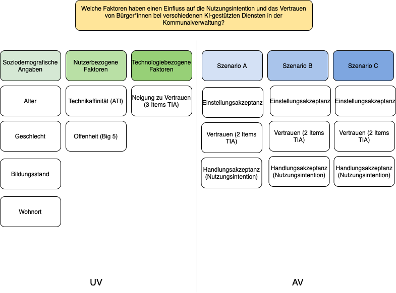

```{r include=FALSE}
library(psych)
library(tidyverse)
library(ggthemes)
library(AachenColorPalette)
library(jmv)

df <- readRDS("data/data.rds")

display_aachen_colors()

library(ggplot2)

```
# Teammitglieder
* NS
* AB
* KA
* YK

# Forschungsfrage
* Welche Faktoren haben einen Einfluss auf die Nutzungsintention und das Vertrauen von Bürger*innen bei verschiedenen KI-gestützten Diensten in der Kommunalverwaltung?


# Faktorenraum



# Operationalisierung

* Vertrauen & Neigung zu Vertrauen: Trust in Automation Scale (TiA) nach [Körber (2018)](https://link.springer.com/chapter/10.1007/978-3-319-96074-6_2 "Körber, M.(2018. Theoretical Considerations and Development of a Questionnaire to Measure Trust in Automation. In: Proceedings of the 20th Congress of the International Ergonomics Association (IEA 2018), Springer, Cham.") in 19 Items.
* Technikaffinität: interaktionsbezogene Technikaffinität (ATI) nach [Franke, Attig, Wessel (2019)](https://ati-scale.org/assets/scales/ati-scala_german_2022-02-25.pdf "Franke, Attig, Wessel(2019. Fragebogen zur interaktionsbezogenen Technikaffinität (ATI) (Affinity for Technology (ATI)Scale, Deutsche Version))") in 9 Items. 
* Offenheit: Big 5 Inventory (BFI-10) nach [Rammstedt, Kemper, Klein, Beierlein, Kovaleva(2014)](https://doi.org/10.6102/zis76 "Rammstedt, B., Kemper, C.J., Klein, M.C., Beierlein, C., Kovaleva, A.(2014. Big 5 Inventory)") in 10 Items.
* Handlungsakzeptanz: Behavioural Attention - User Acceptance of Information Technology nach [Venkatesh, Morris, Davis, Davis(2003)](https://www.jstor.org/stable/30036540 "Venkatesh, Morris, Davis, Davis(2003. User Acceptance of Information Technology") in 3 Items.

# Deskriptive Statistik
```{r descriptive, echo=FALSE}
descriptives <- psych::describe(df)[c(47:50,52,53,55,56),c(3,4,8,9)]
descriptives$alpha <- c(0.465214657291492, 0.639976566831606, 0.892375749746361, 
0.738053724522986, 0.904839950075016, 0.93842635249218, 0.835814252681724, 0.957853468239536)
descriptives[,c(5, 1:4)]
```

# Hypothesen

*Einfache Zusammenhangshypothese*

*H1* Es gibt einen Zusammenhang zwischen Alter und dem Vertrauen in KI-erstellte Gebührenbescheide.
```{r include=FALSE}
cor.test(df$Age, df$TIA_A)
```
```{r echo=FALSE}
ggplot(df) +
  aes(x = Age, y = TIA_A) +
  geom_jitter(colour = "#112446") +
  labs(
    x = "Alter in Jahren",
    y = "Vertrauen in KI",
    title = paste0("Zusammenhangs zwischen Alter und Vetrauen n = (", nrow(df), ")"),
    subtitle = "Jitter-Plot des Zusammenhangs zwischen Alter und Vetrauen in KI-erstellte Gebührenbescheide",
    caption = ""
  ) +
  theme_minimal()

```


*H2* Es gibt einen positiven Zusammenhang zwischen der Neigung, in Technik zu vertrauen und der Einstellung von Bürger*innen gegenüber einem Chatbot für Rückfragen in der Kommunalverwaltung. (gerichtet; Pearson-Korrelation)
```{r include=FALSE}
cor.test(df$TIA_B, df$BI_B)
```
```{r echo=FALSE}
ggplot(df) +
  aes(x = TIA_B, y = BI_B) +
  geom_jitter(colour = "#112446") +
  labs(
    x = "Neigung, in Technik zu vertrauen",
    y = "Einstellung gegenüber KI",
    title = paste0("Zusammenhangs zwischen der Neigung, in Technik zu vertrauen 
                   und der Einstellung von Bürger*innen gegenüber einem 
                   Chatbot n = (", nrow(df), ")"),
    subtitle = "Jitter-Plot des Zusammenhangs zwischen der Neigung, in Technik zu vertrauen und
    der Einstellung von Bürger*innen gegenüber einem Chatbot für Rückfragen 
    in der Kommunalverwaltung ",
    caption = ""
  ) +
  theme_minimal()


```


*H3* Es gibt einen negativen Zusammenhang zwischen dem Alter und der Nutzungsintention von Bürger*innen bei einem Chatbot für Formularausfüllung in der Kommunalverwaltung. (gerichtet; Spearman-Korrelation oder Kendall-Tau-Korellation)
```{r include=FALSE}
cor.test(df$Age, df$BI_C)
```
```{r echo=FALSE}
ggplot(df) +
  aes(x = Age, y = BI_C) +
  geom_jitter(colour = "#112446") +
  labs(
    x = "Alter",
    y = "Nutzungsintention von KI",
    title = paste0("Zusammenhangs zwischen Alter und der Nutzungsintention n = (", nrow(df), ")"),
    subtitle = "Jitter-Plot des Zusammenhangs zwischen dem Alter 
    und der Nutzungsintention von Bürger*innen bei einem Chatbot 
    für Formularausfüllung in der Kommunalverwaltung. ",
    caption = ""
  ) +
  theme_minimal()
```


*Komplexe Zusammenhangshypothese*

*H4* Der Bildungsstand, Offenheit und Technikaffinität haben einen Einfluss auf die Nutzungsintention von Bürger*innen bei einem KI-gestützten Dienst für Gebührenbescheide in der Kommunalverwaltung. (Multiple lineare Regression) 
```{r echo=FALSE}
df$bildungsabschlussforregression <- as.numeric(df$Bildungsabschluss)
jmv::linReg(df,
            dep = c("BI_A"),
            covs = c("bildungsabschlussforregression", "BF_Offenheit", "ATI"),
            blocks = c("bildungsabschlussforregression", "ATI", "BF_Offenheit"),
            r2Adj = TRUE, stdEst = TRUE, modelTest = TRUE)
```


*Einfache Unterschiedshypothese*

*H5* Personen, die in urbanen Regionen leben, haben ein größeres Vertrauen in bei einem Chatbot für Rückfragen in der Kommunalverwaltung als Personen, die in ländlichen Regionen leben. (Unverbundener T-Test)
```{r include=FALSE}
t.test(filter(df, Wohnort == "Großstadt")$TIA_B, filter(df, Wohnort == "Ländlich")$TIA_B)
```
```{r echo=FALSE}
df %>% 
  filter(Wohnort == "Großstadt" | Wohnort == "Ländlich" | Wohnort == "Vorort / Kleinstadt") %>% 
  group_by(Wohnort) %>% 
  summarise(Mean = mean(TIA_B, na.rm = TRUE), SE = plotrix::std.error(TIA_B, na.rm = TRUE)*1.96) %>% 
ggplot() +
  aes(x = Wohnort, weight = Mean, ymin = Mean - SE, ymax = Mean + SE) +
  geom_bar(fill = aachen_color("blue50")) +
  geom_errorbar( width = 0.2) +
  labs(
    x = "Wohnort",
    y = "Vertrauen in KI",
    title = paste0("Vertrauen in einen Chatbot abhängig vom Wohnort n = (", nrow(df), ")"),
    subtitle = "Balkendiagramm zu dem Zusammenhang in das Vertrauen von einem Chatbot für Rückfragen
    abhängig vom Wohnort",
    caption = " "
  ) +
  theme_minimal()
```


*H6* Personen mit einer höheren Neigung, Technik zu vertrauen haben eine höhere Nutzungsintention bei einem Chatbot für Rückfragen in der Kommunalverwaltung als Personen mit einer geringen Neigung, Technik zu vertrauen. (Unverbundener T-Test)
```{r include=FALSE}
t.test(filter(df, Vertrauen >= median(df$Vertrauen))$BI_B, filter(df, Vertrauen < median(df$Vertrauen))$BI_B)
```
```{r echo=FALSE}
df$trustgroup <- cut(df$Vertrauen, breaks = c(-Inf, median(df$Vertrauen), +Inf),labels = c("niedrig", "hoch"))
df %>% 
  group_by(trustgroup) %>% 
  summarise(Mean = mean(BI_B, na.rm = TRUE), SE = plotrix::std.error(BI_B, na.rm = TRUE)*1.96) %>% 
ggplot() +
  aes(x = trustgroup, weight = Mean, ymin = Mean - SE, ymax = Mean + SE) +
  geom_bar(fill = aachen_color("blue50")) +
  geom_errorbar( width = 0.2) +
  labs(
    x = "Neigung, in Technik zu vertrauen",
    y = "Nutzungsintention",
    title = paste0("Neigung, Technik zu vertrauen und Nutzungsintention eines Chatbots n = (", nrow(df), ")"),
    subtitle = "Balkendiagramm der Neigung, in Technik zu vertrauen und der 
    Nutzungsintention eines Chatbots für Rückfragen in 
    der Kommunalverwaltung",
    caption = " "
  ) +
  theme_minimal()
```


*H7*  Die Nutzungsintention von BürgerInnen bei einem Chatbot für Rückfragen in der Kommunalverwaltung unterscheidet sich von der Nutzungsintention von BürgerInnen bei einem Chatbot für die Formularausfüllung in der Kommunalverwaltung. [Within-subject-design (Verbundener T- Test)]
```{r include=FALSE}
t.test(df$BI_B, df$BI_C, paired = T)
```
```{r echo=FALSE}
df_paired <- data.frame(group = c(rep("Rückfragen", nrow(df)), rep("Formularausfüllung", nrow(df))),
                        value = c(df$BI_B, df$BI_C))
df_paired %>% 
   group_by(group) %>% 
  summarise(Mean = mean(value, na.rm = TRUE), SE = plotrix::std.error(value, na.rm = TRUE)*1.96) %>% 
ggplot() +
  aes(x = group, weight = Mean, ymin = Mean - SE, ymax = Mean + SE) +
  geom_bar(fill = aachen_color("blue50")) +
  geom_errorbar( width = 0.2) +
  labs(
    x = "Nutzungsintention bei Chatbot Kommunalverwaltung",
    y = "Nutzungsintention bei Chatbot Formularausfüllung",
    title = paste0("Unterschied der Nutzungsintention n = (", nrow(df), ")"),
    subtitle = "Balkendiagramm der Nutzungsintention von BürgerInnen 
    bei Chatbots für Rückfragen in der Kommunalverwaltung 
    und der Formularausfüllung",
    caption = " "
  ) +
  theme_minimal()
```


*Komplexe Unterschiedshypothese*

*H8* Geschlecht hat einen Einfluss auf die Nutzungsintention und das Vertrauen von Bürger*innen in einen KI-gestützten Dienst für Gebührenbescheide in der Kommunalverwaltung. (Einfaktorielle MANOVA)
```{r echo=FALSE}
mancova(df, factors = "Gender", deps = c("BI_A", "TIA_A"))
```


*Diagramm Alterverteilung*

```{r echo=FALSE}
ggplot(df) +
  aes(x = Age) +
  geom_histogram(bins = 30L, fill = aachen_color("blue50")) +
  geom_vline(xintercept = mean(df$Age, na.rm = TRUE)) +
  geom_text(x = mean(df$Age, na.rm = TRUE), y = 30, label = paste0("M = ", round(mean(df$Age, na.rm = TRUE), 2)), angle = 90 , vjust = 1.5) +
  labs(x = "Alter in Jahren", 
       y = "Anzahl", 
       title = paste0("Altersverteiliung n = (", nrow(df), ")"), 
       subtitle = "Histogramm der Altersverteilung", 
       caption = "30 Bins") +
  theme_minimal()
```


