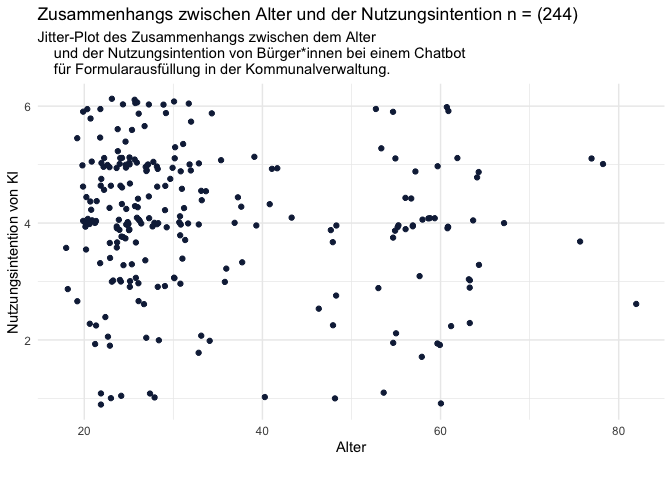

# Teammitglieder

-   NS
-   AB
-   KA
-   YK

# Forschungsfrage

-   Welche Faktoren haben einen Einfluss auf die Nutzungsintention und
    das Vertrauen von Bürger\*innen bei verschiedenen KI-gestützten
    Diensten in der Kommunalverwaltung?

# Faktorenraum

<figure>

<figcaption aria-hidden="true">Faktorenraum</figcaption>
</figure>

# Operationalisierung

-   Vertrauen & Neigung zu Vertrauen: Trust in Automation Scale (TiA)
    nach [Körber
    (2018)](https://link.springer.com/chapter/10.1007/978-3-319-96074-6_2 "Körber, M.(2018. Theoretical Considerations and Development of a Questionnaire to Measure Trust in Automation. In: Proceedings of the 20th Congress of the International Ergonomics Association (IEA 2018), Springer, Cham.")
    in 19 Items.
-   Technikaffinität: interaktionsbezogene Technikaffinität (ATI) nach
    [Franke, Attig, Wessel
    (2019)](https://ati-scale.org/assets/scales/ati-scala_german_2022-02-25.pdf "Franke, Attig, Wessel(2019. Fragebogen zur interaktionsbezogenen Technikaffinität (ATI) (Affinity for Technology (ATI)Scale, Deutsche Version))")
    in 9 Items.
-   Offenheit: Big 5 Inventory (BFI-10) nach [Rammstedt, Kemper, Klein,
    Beierlein,
    Kovaleva(2014)](https://doi.org/10.6102/zis76 "Rammstedt, B., Kemper, C.J., Klein, M.C., Beierlein, C., Kovaleva, A.(2014. Big 5 Inventory)")
    in 10 Items.
-   Handlungsakzeptanz: Behavioural Attention - User Acceptance of
    Information Technology nach [Venkatesh, Morris, Davis,
    Davis(2003)](https://www.jstor.org/stable/30036540 "Venkatesh, Morris, Davis, Davis(2003. User Acceptance of Information Technology")
    in 3 Items.

# Hypothesen

*Einfache Zusammenhangshypothese*

*H1* Es gibt einen Zusammenhang zwischen Alter und dem Vertrauen in
KI-erstellte Gebührenbescheide.

    cor.test(df$Age, df$TIA_A)

    ## 
    ##  Pearson's product-moment correlation
    ## 
    ## data:  df$Age and df$TIA_A
    ## t = -0.40617, df = 698, p-value = 0.6847
    ## alternative hypothesis: true correlation is not equal to 0
    ## 95 percent confidence interval:
    ##  -0.08937302  0.05879783
    ## sample estimates:
    ##         cor 
    ## -0.01537199

*H2* Es gibt einen positiven Zusammenhang zwischen der Neigung, in
Technik zu vertrauen und der Einstellung von Bürger\*innen gegenüber
einem Chatbot für Rückfragen in der Kommunalverwaltung. (gerichtet;
Pearson-Korrelation)

    cor.test(df$TIA_B, df$BI_B)

    ## 
    ##  Pearson's product-moment correlation
    ## 
    ## data:  df$TIA_B and df$BI_B
    ## t = -0.3478, df = 698, p-value = 0.7281
    ## alternative hypothesis: true correlation is not equal to 0
    ## 95 percent confidence interval:
    ##  -0.08718103  0.06099911
    ## sample estimates:
    ##         cor 
    ## -0.01316323

*H3* Es gibt einen negativen Zusammenhang zwischen dem Alter und der
Nutzungsintention von Bürger\*innen bei einem Chatbot für
Formularausfüllung in der Kommunalverwaltung. (gerichtet;
Spearman-Korrelation oder Kendall-Tau-Korellation)

    cor.test(df$Age, df$BI_C)

    ## 
    ##  Pearson's product-moment correlation
    ## 
    ## data:  df$Age and df$BI_C
    ## t = 1.5299, df = 698, p-value = 0.1265
    ## alternative hypothesis: true correlation is not equal to 0
    ## 95 percent confidence interval:
    ##  -0.01636238  0.13135070
    ## sample estimates:
    ##        cor 
    ## 0.05781055

*Komplexe Zusammenhangshypothese*

*H4* Der Bildungsstand, Offenheit und Technikaffinität haben einen
Einfluss auf die Nutzungsintention von Bürger\*innen bei einem
KI-gestützten Dienst für Gebührenbescheide in der Kommunalverwaltung.
(Multiple lineare Regression)

*Einfache Unterschiedshypothese*

*H5* Personen, die in urbanen Regionen leben, haben ein größeres
Vertrauen in bei einem Chatbot für Rückfragen in der Kommunalverwaltung
als Personen, die in ländlichen Regionen leben. (Unverbundener T-Test)

    t.test(filter(df, Wohnort == "Großstadt")$TIA_B, filter(df, Wohnort == "Ländlich")$TIA_B)

    ## 
    ##  Welch Two Sample t-test
    ## 
    ## data:  filter(df, Wohnort == "Großstadt")$TIA_B and filter(df, Wohnort == "Ländlich")$TIA_B
    ## t = -0.52391, df = 429.58, p-value = 0.6006
    ## alternative hypothesis: true difference in means is not equal to 0
    ## 95 percent confidence interval:
    ##  -0.2764276  0.1600768
    ## sample estimates:
    ## mean of x mean of y 
    ##  3.529126  3.587302

*H6* Personen mit einer höheren Neigung, Technik zu vertrauen haben eine
höhere Nutzungsintention bei einem Chatbot für Rückfragen in der
Kommunalverwaltung als Personen mit einer geringen Neigung, Technik zu
vertrauen. (Unverbundener T-Test)

    t.test(filter(df, Vertrauen >= median(df$Vertrauen))$BI_B, filter(df, Vertrauen < median(df$Vertrauen))$BI_B)

    ## 
    ##  Welch Two Sample t-test
    ## 
    ## data:  filter(df, Vertrauen >= median(df$Vertrauen))$BI_B and filter(df, Vertrauen < median(df$Vertrauen))$BI_B
    ## t = -1.3175, df = 580.32, p-value = 0.1882
    ## alternative hypothesis: true difference in means is not equal to 0
    ## 95 percent confidence interval:
    ##  -0.24774358  0.04881003
    ## sample estimates:
    ## mean of x mean of y 
    ##  3.451258  3.550725

*H7* Die Nutzungsintention von BürgerInnen bei einem Chatbot für
Rückfragen in der Kommunalverwaltung unterscheidet sich von der
Nutzungsintention von BürgerInnen bei einem Chatbot für die
Formularausfüllung in der Kommunalverwaltung. \[Within-subject-design
(Verbundener T- Test)\]

    t.test(df$BI_B, df$BI_C, paired = T)

    ## 
    ##  Paired t-test
    ## 
    ## data:  df$BI_B and df$BI_C
    ## t = -0.61198, df = 699, p-value = 0.5407
    ## alternative hypothesis: true mean difference is not equal to 0
    ## 95 percent confidence interval:
    ##  -0.13025410  0.06834934
    ## sample estimates:
    ## mean difference 
    ##     -0.03095238

*Komplexe Unterschiedshypothese*

*H8* Geschlecht hat einen Einfluss auf die Nutzungsintention und das
Vertrauen von Bürger\*innen in einen KI-gestützten Dienst für
Gebührenbescheide in der Kommunalverwaltung. (Einfaktorielle MANOVA)

*Diagramm Alterverteilung*

