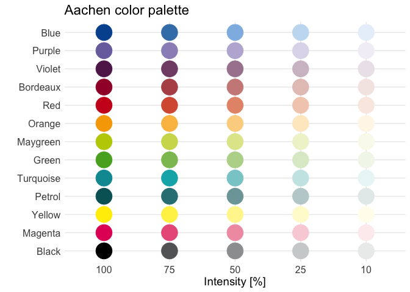
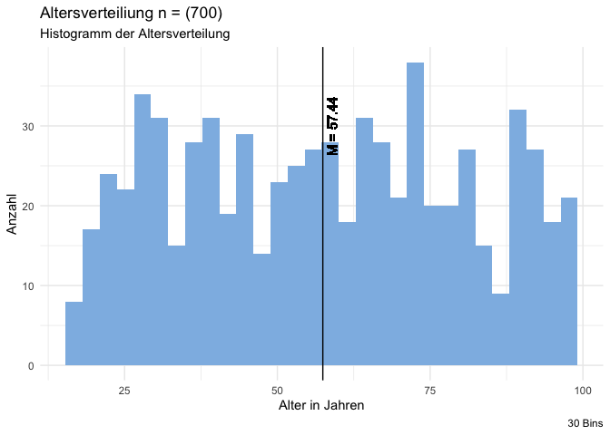

# Teammitglieder

-   NS
-   AB
-   KA
-   YK

# Forschungsfrage

-   Welche Faktoren haben einen Einfluss auf die Nutzungsintention und
    das Vertrauen von Bürger\*innen bei verschiedenen KI-gestützten
    Diensten in der Kommunalverwaltung?

# Faktorenraum

<figure>

<figcaption aria-hidden="true">Faktorenraum</figcaption>
</figure>

# Operationalisierung

-   Vertrauen & Neigung zu Vertrauen: Trust in Automation Scale (TiA)
    nach [Körber
    (2018)](https://link.springer.com/chapter/10.1007/978-3-319-96074-6_2 "Körber, M.(2018. Theoretical Considerations and Development of a Questionnaire to Measure Trust in Automation. In: Proceedings of the 20th Congress of the International Ergonomics Association (IEA 2018), Springer, Cham.")
    in 19 Items.
-   Technikaffinität: interaktionsbezogene Technikaffinität (ATI) nach
    [Franke, Attig, Wessel
    (2019)](https://ati-scale.org/assets/scales/ati-scala_german_2022-02-25.pdf "Franke, Attig, Wessel(2019. Fragebogen zur interaktionsbezogenen Technikaffinität (ATI) (Affinity for Technology (ATI)Scale, Deutsche Version))")
    in 9 Items.
-   Offenheit: Big 5 Inventory (BFI-10) nach [Rammstedt, Kemper, Klein,
    Beierlein,
    Kovaleva(2014)](https://doi.org/10.6102/zis76 "Rammstedt, B., Kemper, C.J., Klein, M.C., Beierlein, C., Kovaleva, A.(2014. Big 5 Inventory)")
    in 10 Items.
-   Handlungsakzeptanz: Behavioural Attention - User Acceptance of
    Information Technology nach [Venkatesh, Morris, Davis,
    Davis(2003)](https://www.jstor.org/stable/30036540 "Venkatesh, Morris, Davis, Davis(2003. User Acceptance of Information Technology")
    in 3 Items.

# Hypothesen

*Einfache Zusammenhangshypothese*

*H1* Es gibt einen Zusammenhang zwischen Alter und dem Vertrauen in
KI-erstellte Gebührenbescheide.

*H2* Es gibt einen positiven Zusammenhang zwischen der Neigung, in
Technik zu vertrauen und der Einstellung von Bürger\*innen gegenüber
einem Chatbot für Rückfragen in der Kommunalverwaltung. (gerichtet;
Pearson-Korrelation)

*H3* Es gibt einen negativen Zusammenhang zwischen dem Alter und der
Nutzungsintention von Bürger\*innen bei einem Chatbot für
Formularausfüllung in der Kommunalverwaltung. (gerichtet;
Spearman-Korrelation oder Kendall-Tau-Korellation)

*Komplexe Zusammenhangshypothese*

*H4* Der Bildungsstand, Offenheit und Technikaffinität haben einen
Einfluss auf die Nutzungsintention von Bürger\*innen bei einem
KI-gestützten Dienst für Gebührenbescheide in der Kommunalverwaltung.
(Multiple lineare Regression)

*Einfache Unterschiedshypothese*

*H5* Personen, die in urbanen Regionen leben, haben ein größeres
Vertrauen in bei einem Chatbot für Rückfragen in der Kommunalverwaltung
als Personen, die in ländlichen Regionen leben. (Unverbundener T-Test)

*H6* Personen mit einer höheren Neigung, Technik zu vertrauen haben eine
höhere Nutzungsintention bei einem Chatbot für Formularausfüllung in der
Kommunalverwaltung als Personen mit einer geringen Neigung, Technik zu
vertrauen. (Unverbundener T-Test)

*H7* Die Nutzungsintention von BürgerInnen bei einem Chatbot für
Rückfragen in der Kommunalverwaltung unterscheidet sich von der
Nutzungsintention von BürgerInnen bei einem Chatbot für die
Formularausfüllung in der Kommunalverwaltung. \[Within-subject-design
(Verbundener T- Test)\]

*Komplexe Unterschiedshypothese*

*H8* Geschlecht hat einen Einfluss auf die Nutzungsintention und das
Vertrauen von Bürger\*innen in einen KI-gestützten Dienst für
Gebührenbescheide in der Kommunalverwaltung. (Einfaktorielle MANOVA)

*Diagramm Alterverteilung*

    library(tidyverse)

    ## ── Attaching core tidyverse packages ──────────────────────── tidyverse 2.0.0 ──
    ## ✔ dplyr     1.1.4     ✔ readr     2.1.5
    ## ✔ forcats   1.0.0     ✔ stringr   1.5.1
    ## ✔ ggplot2   3.5.1     ✔ tibble    3.2.1
    ## ✔ lubridate 1.9.3     ✔ tidyr     1.3.1
    ## ✔ purrr     1.0.2     
    ## ── Conflicts ────────────────────────────────────────── tidyverse_conflicts() ──
    ## ✖ dplyr::filter() masks stats::filter()
    ## ✖ dplyr::lag()    masks stats::lag()
    ## ℹ Use the conflicted package (<http://conflicted.r-lib.org/>) to force all conflicts to become errors

    library(ggthemes)
    library(AachenColorPalette)

    df <- readRDS("data/data.rds")

    display_aachen_colors()

    library(ggplot2)

    ggplot(df) +
      aes(x = Age) +
      geom_histogram(bins = 30L, fill = aachen_color("blue50")) +
      geom_vline(xintercept = mean(df$Age, na.rm = TRUE)) +
      geom_text(x = mean(df$Age, na.rm = TRUE), y = 30, label = paste0("M = ", round(mean(df$Age, na.rm = TRUE), 2)), angle = 90 , vjust = 1.5) +
      labs(x = "Alter in Jahren", 
           y = "Anzahl", 
           title = paste0("Altersverteiliung n = (", nrow(df), ")"), 
           subtitle = "Histogramm der Altersverteilung", 
           caption = "30 Bins") +
      theme_minimal()

