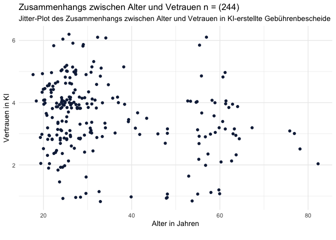
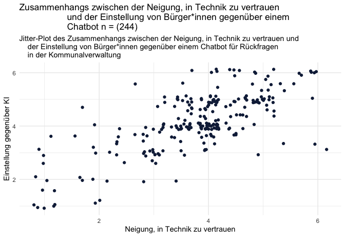
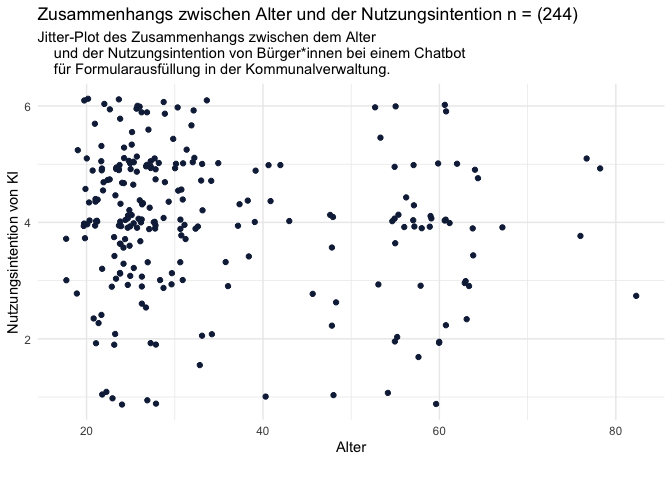
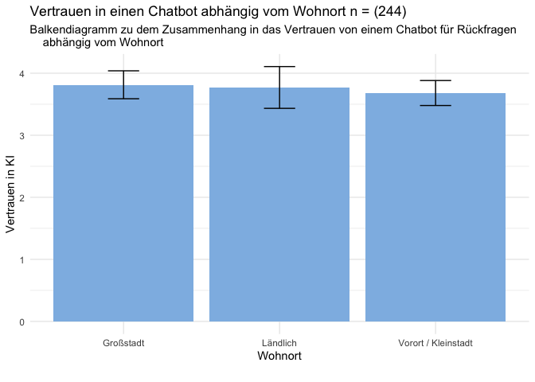

# Teammitglieder

-   NS
-   AB
-   KA
-   YK

# Forschungsfrage

-   Welche Faktoren haben einen Einfluss auf die Nutzungsintention und
    das Vertrauen von Bürger\*innen bei verschiedenen KI-gestützten
    Diensten in der Kommunalverwaltung?

# Faktorenraum

<figure>

<figcaption aria-hidden="true">Faktorenraum</figcaption>
</figure>

# Operationalisierung

-   Vertrauen & Neigung zu Vertrauen: Trust in Automation Scale (TiA)
    nach [Körber
    (2018)](https://link.springer.com/chapter/10.1007/978-3-319-96074-6_2 "Körber, M.(2018. Theoretical Considerations and Development of a Questionnaire to Measure Trust in Automation. In: Proceedings of the 20th Congress of the International Ergonomics Association (IEA 2018), Springer, Cham.")
    in 19 Items.
-   Technikaffinität: interaktionsbezogene Technikaffinität (ATI) nach
    [Franke, Attig, Wessel
    (2019)](https://ati-scale.org/assets/scales/ati-scala_german_2022-02-25.pdf "Franke, Attig, Wessel(2019. Fragebogen zur interaktionsbezogenen Technikaffinität (ATI) (Affinity for Technology (ATI)Scale, Deutsche Version))")
    in 9 Items.
-   Offenheit: Big 5 Inventory (BFI-10) nach [Rammstedt, Kemper, Klein,
    Beierlein,
    Kovaleva(2014)](https://doi.org/10.6102/zis76 "Rammstedt, B., Kemper, C.J., Klein, M.C., Beierlein, C., Kovaleva, A.(2014. Big 5 Inventory)")
    in 10 Items.
-   Handlungsakzeptanz: Behavioural Attention - User Acceptance of
    Information Technology nach [Venkatesh, Morris, Davis,
    Davis(2003)](https://www.jstor.org/stable/30036540 "Venkatesh, Morris, Davis, Davis(2003. User Acceptance of Information Technology")
    in 3 Items.

# Deskriptive Statistik

    ##              alpha mean   sd  min  max
    ## BF_Offenheit  0.47 4.17 1.09 1.50 6.00
    ## Vertrauen     0.64 3.44 0.85 1.00 6.00
    ## ATI           0.89 3.58 0.98 1.33 5.78
    ## BI_A          0.74 3.77 1.03 1.00 6.00
    ## TIA_A         0.90 3.56 1.16 1.00 6.00
    ## BI_B          0.94 4.16 1.10 1.00 6.00
    ## TIA_B         0.84 3.77 1.10 1.00 6.00
    ## BI_C          0.96 4.04 1.20 1.00 6.00

# Hypothesen

*Einfache Zusammenhangshypothese*

*H1* Es gibt einen Zusammenhang zwischen Alter und dem Vertrauen in
KI-erstellte Gebührenbescheide.

    ## Warning: Removed 5 rows containing missing values or values outside the scale range
    ## (`geom_point()`).

*H2* Es gibt einen positiven Zusammenhang zwischen der Neigung, in
Technik zu vertrauen und der Einstellung von Bürger\*innen gegenüber
einem Chatbot für Rückfragen in der Kommunalverwaltung. (gerichtet;
Pearson-Korrelation)

*H3* Es gibt einen negativen Zusammenhang zwischen dem Alter und der
Nutzungsintention von Bürger\*innen bei einem Chatbot für
Formularausfüllung in der Kommunalverwaltung. (gerichtet;
Spearman-Korrelation oder Kendall-Tau-Korellation)

    ## Warning: Removed 5 rows containing missing values or values outside the scale range
    ## (`geom_point()`).

*Komplexe Zusammenhangshypothese*

*H4* Der Bildungsstand, Offenheit und Technikaffinität haben einen
Einfluss auf die Nutzungsintention von Bürger\*innen bei einem
KI-gestützten Dienst für Gebührenbescheide in der Kommunalverwaltung.
(Multiple lineare Regression)

    ## 
    ##  LINEAR REGRESSION
    ## 
    ##  Model Fit Measures                                                                         
    ##  ────────────────────────────────────────────────────────────────────────────────────────── 
    ##    Model    R            R²            Adjusted R²    F           df1    df2    p           
    ##  ────────────────────────────────────────────────────────────────────────────────────────── 
    ##        1    0.1861850    0.03466484     0.03057444    8.474675      1    236    0.0039460   
    ##        2    0.2384281    0.05684796     0.04882114    7.082247      2    235    0.0010312   
    ##        3    0.2434627    0.05927408     0.04721349    4.914692      3    234    0.0024904   
    ##  ────────────────────────────────────────────────────────────────────────────────────────── 
    ##    Note. Models estimated using sample size of N=238
    ## 
    ## 
    ##  Model Comparisons                                                              
    ##  ────────────────────────────────────────────────────────────────────────────── 
    ##    Model         Model    ΔR²            F            df1    df2    p           
    ##  ────────────────────────────────────────────────────────────────────────────── 
    ##        1    -        2    0.022183123    5.5272466      1    235    0.0195498   
    ##        2    -        3    0.002426121    0.6034833      1    234    0.4380367   
    ##  ────────────────────────────────────────────────────────────────────────────── 
    ## 
    ## 
    ##  MODEL SPECIFIC RESULTS
    ## 
    ##  MODEL 1
    ## 
    ##  Model Coefficients - BI_A                                                                                  
    ##  ────────────────────────────────────────────────────────────────────────────────────────────────────────── 
    ##    Predictor                         Estimate     SE            t           p             Stand. Estimate   
    ##  ────────────────────────────────────────────────────────────────────────────────────────────────────────── 
    ##    Intercept                         2.8881911    0.30883571    9.351869    < .0000001                      
    ##    bildungsabschlussforregression    0.2083189    0.07155947    2.911130     0.0039460          0.1861850   
    ##  ────────────────────────────────────────────────────────────────────────────────────────────────────────── 
    ## 
    ## 
    ##  MODEL 2
    ## 
    ##  Model Coefficients - BI_A                                                                                  
    ##  ────────────────────────────────────────────────────────────────────────────────────────────────────────── 
    ##    Predictor                         Estimate     SE            t           p             Stand. Estimate   
    ##  ────────────────────────────────────────────────────────────────────────────────────────────────────────── 
    ##    Intercept                         2.3983501    0.37012892    6.479769    < .0000001                      
    ##    bildungsabschlussforregression    0.1893807    0.07133907    2.654656     0.0084815          0.1692590   
    ##    ATI                               0.1587761    0.06753529    2.351010     0.0195498          0.1498987   
    ##  ────────────────────────────────────────────────────────────────────────────────────────────────────────── 
    ## 
    ## 
    ##  MODEL 3
    ## 
    ##  Model Coefficients - BI_A                                                                                   
    ##  ─────────────────────────────────────────────────────────────────────────────────────────────────────────── 
    ##    Predictor                         Estimate      SE            t            p            Stand. Estimate   
    ##  ─────────────────────────────────────────────────────────────────────────────────────────────────────────── 
    ##    Intercept                         2.23261144    0.42748668    5.2226456    0.0000004                      
    ##    bildungsabschlussforregression    0.18267161    0.07191976    2.5399365    0.0117355         0.16326271   
    ##    ATI                               0.15792734    0.06760116    2.3361630    0.0203282         0.14909736   
    ##    BF_Offenheit                      0.04723040    0.06079796    0.7768419    0.4380367         0.04963672   
    ##  ───────────────────────────────────────────────────────────────────────────────────────────────────────────

*Einfache Unterschiedshypothese*

*H5* Personen, die in urbanen Regionen leben, haben ein größeres
Vertrauen in bei einem Chatbot für Rückfragen in der Kommunalverwaltung
als Personen, die in ländlichen Regionen leben. (Unverbundener T-Test)

*H6* Personen mit einer höheren Neigung, Technik zu vertrauen haben eine
höhere Nutzungsintention bei einem Chatbot für Rückfragen in der
Kommunalverwaltung als Personen mit einer geringen Neigung, Technik zu
vertrauen. (Unverbundener T-Test)

*H7* Die Nutzungsintention von BürgerInnen bei einem Chatbot für
Rückfragen in der Kommunalverwaltung unterscheidet sich von der
Nutzungsintention von BürgerInnen bei einem Chatbot für die
Formularausfüllung in der Kommunalverwaltung. \[Within-subject-design
(Verbundener T- Test)\]

*Komplexe Unterschiedshypothese*

*H8* Geschlecht hat einen Einfluss auf die Nutzungsintention und das
Vertrauen von Bürger\*innen in einen KI-gestützten Dienst für
Gebührenbescheide in der Kommunalverwaltung. (Einfaktorielle MANOVA)

    ## 
    ##  MANCOVA
    ## 
    ##  Multivariate Tests                                                                     
    ##  ────────────────────────────────────────────────────────────────────────────────────── 
    ##                                    value         F            df1    df2    p           
    ##  ────────────────────────────────────────────────────────────────────────────────────── 
    ##    Gender    Pillai's Trace        0.02428113    0.9626985      6    470    0.4499818   
    ##              Wilks' Lambda          0.9757592    0.9629343      6    468    0.4498240   
    ##              Hotelling's Trace     0.02480171    0.9631332      6    466    0.4496917   
    ##              Roy's Largest Root    0.02300582     1.802123      3    235    0.1474812   
    ##  ────────────────────────────────────────────────────────────────────────────────────── 
    ## 
    ## 
    ##  Univariate Tests                                                                                      
    ##  ───────────────────────────────────────────────────────────────────────────────────────────────────── 
    ##                 Dependent Variable    Sum of Squares    df     Mean Square    F            p           
    ##  ───────────────────────────────────────────────────────────────────────────────────────────────────── 
    ##    Gender       BI_A                        5.799178      3       1.933059    1.8009735    0.1476956   
    ##                 TIA_A                       3.465029      3       1.155010    0.8465403    0.4696509   
    ##    Residuals    BI_A                      252.235225    235       1.073341                             
    ##                 TIA_A                     320.631206    235       1.364388                             
    ##  ─────────────────────────────────────────────────────────────────────────────────────────────────────

*Diagramm Alterverteilung*

    ## Warning: Removed 5 rows containing non-finite outside the scale range
    ## (`stat_bin()`).

